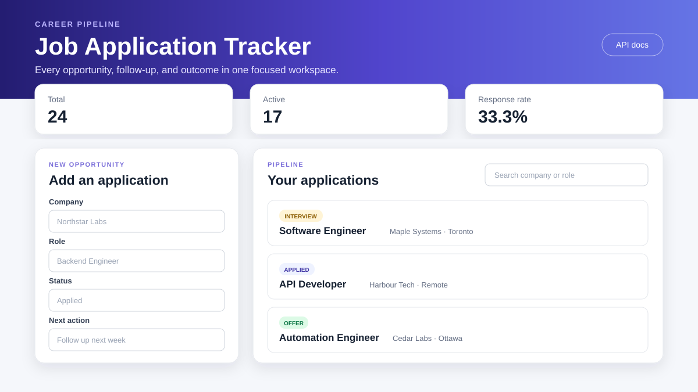
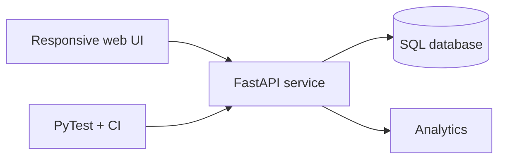

# Job Application Tracker

[](https://github.com/PhilipOkeke/job-application-tracker/actions/workflows/ci.yml)
[](https://github.com/PhilipOkeke/job-application-tracker/actions/workflows/codeql.yml)

A responsive full-stack application for organizing job opportunities, follow-ups, and outcomes. It combines a FastAPI REST API, SQL persistence, a browser interface, pipeline analytics, automated tests, Docker, and security automation in one independently useful project.



## What it demonstrates

- Full-stack product development with Python and browser-native JavaScript
- CRUD API design, filtering, search, pagination, validation, and analytics
- SQLModel persistence with SQLite locally and a PostgreSQL-ready configuration
- Responsive, accessible UI without a frontend framework dependency
- Automated quality gates with PyTest, Ruff, GitHub Actions, and CodeQL
- Reproducible execution through Docker and Docker Compose

## Architecture



## Features

- Track company, role, location, status, application date, next action, and notes
- Search across company and role
- Filter the pipeline by status
- Update or delete an application
- Review total applications, active opportunities, and response rate
- Use the same functionality through interactive OpenAPI documentation
- Validate salary ranges and return consistent HTTP errors

## Run locally

```bash
python -m venv .venv
source .venv/bin/activate
pip install -e ".[dev]"
uvicorn app.main:app --reload
```

Open `http://127.0.0.1:8000` for the application or `http://127.0.0.1:8000/docs` for Swagger UI.

## Run with Docker

```bash
docker compose up --build
```

Application data is retained in the `tracker-data` volume.

## API

| Method | Endpoint | Purpose |
|---|---|---|
| `GET` | `/health` | Service health |
| `POST` | `/api/applications` | Add an application |
| `GET` | `/api/applications` | Search, filter, and paginate |
| `GET` | `/api/applications/{id}` | Retrieve one application |
| `PATCH` | `/api/applications/{id}` | Update an application |
| `DELETE` | `/api/applications/{id}` | Remove an application |
| `GET` | `/api/analytics` | Pipeline metrics |

## Quality checks

```bash
ruff check .
ruff format --check .
pytest
```

The test suite enforces at least 90% application-code coverage. CI runs on every push and pull request, and CodeQL performs security analysis.

## Project status

This is a portfolio project designed to demonstrate engineering decisions clearly. See [SECURITY.md](SECURITY.md) for private vulnerability reporting and [CONTRIBUTING.md](CONTRIBUTING.md) for the development workflow.
